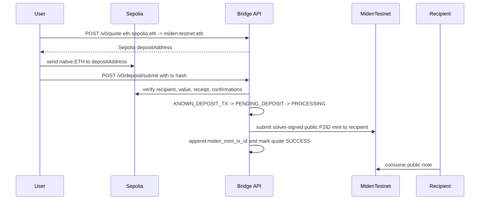
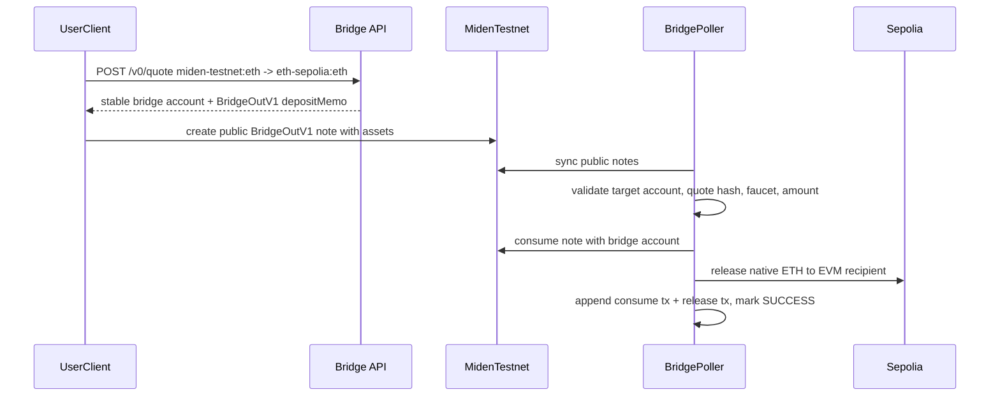
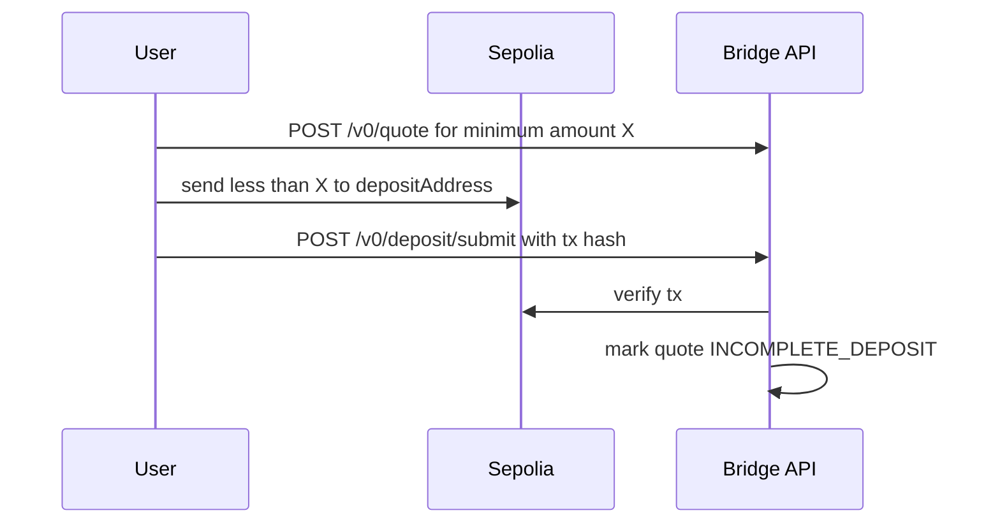
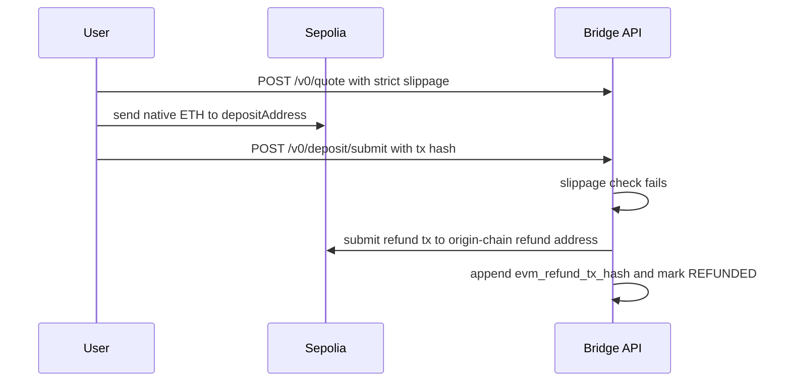

# E2E Handoff - Sepolia + Miden Testnet Sandbox

Snapshot: 2026-05-26.

This handoff describes the current acceptance path only: Sepolia native ETH plus
public Miden testnet. Local EVM profiles are not part of the product path.

## Current Status

- Product shape: mock NEAR Intents 1Click builder sandbox.
- API surface: `/v0/tokens`, `/v0/quote`, `/v0/deposit/submit`, `/v0/status`.
- Demo surface: `/demo/*` and `/lab`, backed by Sepolia testnet.
- Accepted Miden path: public Miden testnet at `https://rpc.testnet.miden.io`.
- Accepted EVM path: live Sepolia native ETH.
- Local Miden node: legacy/manual only, not acceptance evidence.
- Frontend: Next.js lab UI in `frontend/`, served by the `lab-ui` Docker
  service.
- Static evidence page: [`docs/smoke-test-report.html`](./smoke-test-report.html).

The old per-quote Miden account design is no longer the plan. Miden-origin
deposits use public programmable notes. The bridge consumes a valid
`BridgeOutV1` note with a stable bridge account and releases on Sepolia after
the Miden consume tx is confirmed.

## Runtime Shape

Default builder profile:

- `compose.yaml`
- `bridge`
- `lab-ui`
- `postgres`
- public Sepolia native ETH through `EVM_RPC_URL`
- public Miden testnet through `MIDEN_RPC_URL`

Important env:

```bash
MIDEN_RPC_URL=https://rpc.testnet.miden.io
MIDEN_MASTER_SEED_HEX=<unique 32-byte hex seed>
MIDEN_REMOTE_PROVER_URL=        # optional override; native testnet defaults work
MIDEN_REMOTE_PROVER_TIMEOUT_SECS=180
BRIDGE_PROFILE=sepolia
BRIDGE_DEMO_ENABLED=1
BRIDGE_PRICER=mock              # local evidence harness only
EVM_RPC_URL=https://gateway.tenderly.co/public/sepolia
EVM_CHAIN_ID=11155111
EVM_REQUIRED_CONFIRMATIONS=2
EVM_DEPOSIT_SCAN_LOOKBACK_BLOCKS=
SOLVER_PRIVATE_KEY=<funded-sepolia-solver-private-key>
DEMO_EVM_FUNDED_PRIVATE_KEY=<funded-sepolia-test-user-private-key>
```

Sepolia mode does not scan from genesis. The bridge waits for
`/v0/deposit/submit`, then verifies the submitted tx hash pays the quoted
deposit address and has the configured confirmation depth. This avoids
RPC-heavy chain-history scans on public Sepolia.

## Start The Stack

```bash
cp .env.sepolia.example .env
perl -0pi -e "s/MIDEN_MASTER_SEED_HEX=.*/MIDEN_MASTER_SEED_HEX=$(openssl rand -hex 32)/" .env
# Fill EVM_RPC_URL, MASTER_MNEMONIC, SOLVER_PRIVATE_KEY, and DEMO_EVM_FUNDED_PRIVATE_KEY.
make sepolia
```

Useful checks:

```bash
curl -fsS http://localhost:8080/healthz
curl -fsS http://localhost:8080/readyz
curl -fsS http://localhost:3000/health
./bin/bridgectl status
./bin/bridgectl tokens
```

## Live Sepolia Evidence

```bash
RUSTFLAGS='-C debug-assertions=no' cargo run --bin sepolia_e2e 2>&1 | tee sepolia-e2e-live.log
```

The runner reads `.env`, uses the mock 1Click `/v0/*` endpoints, and does not
print private keys. It needs:

- a funded `SOLVER_PRIVATE_KEY`
- a funded `DEMO_EVM_FUNDED_PRIVATE_KEY`
- Sepolia RPC URL
- public Miden testnet RPC
- host access to the Compose Postgres port

Live Sepolia evidence from 2026-05-15:

```text
SEPOLIA_E2E_EVIDENCE inbound correlation_id=3e5ec16b-2fa2-4c0a-8ce7-0ae8725bbac1 evm_deposit_tx_hash=0xaca72ebac72cfbda3cd5957605b8e01f107c37acc9d2bfe118552b0c7cab311a miden_mint_tx_ids=["0x7a4c0ed23a0b13eb4f559ed2f9f82282b38b99dda2138a9b1e94759b3aefa0b6"] claim_tx_id=0x6bf05ee2a2d9f772823abe66cf2417995ecaa71fdbe731b247694ec0f66eccfb
SEPOLIA_E2E_EVIDENCE outbound funding_correlation_id=8b1920ef-ca3b-4fbc-82c5-35f6f8670332 outbound_correlation_id=ab2b3f5d-0d5e-4b86-a013-0f4ddcef05aa funding_evm_deposit_tx_hash=0x3c0e444fa726496ee09cda9c72d2d14d8a07235de81bdf8de94d0a559c899644 bridge_out_note_tx_id=0xe9db64f8a00db3527ebb1f5d443c09ce2ec80c639ccabd7e5b4b6195ea045f2d miden_consume_tx_ids=["0xbaa1789bb950b97bb8300aaebc53e817760f4791ce04b5d971b85f69e4577f81"] evm_release_tx_hashes=["0x23640d4ad68277a065fa6ec70cc26b6bc7d2acf181bf0b6669da1b03fa668885"] balance_delta_wei=1000000000000
```

## Flow: Inbound Sepolia To Miden



## Flow: Outbound Miden To Sepolia



## Flow: Incomplete Deposit



## Flow: Refund



## Validation Checklist

- `docker compose --env-file .env config --quiet`
- `cargo fmt --check`
- `cargo test --lib --test evm --test hardening --test lifecycle --test miden_bridge --test miden_node --test state`
- `cd frontend && npm run typecheck && npm run build`
- `docker compose -f compose.yaml -f compose.local.yml --env-file .env up -d --build --remove-orphans --wait --wait-timeout 900 lab-ui`
- `curl -fsS http://localhost:3000/health`
- `curl -fsS http://localhost:8080/healthz`
- `curl -fsS http://localhost:8080/v0/tokens | jq '.[].assetId'`

The token list should include `eth-sepolia:eth` and Miden testnet assets. It
should not include any local EVM asset namespace.
