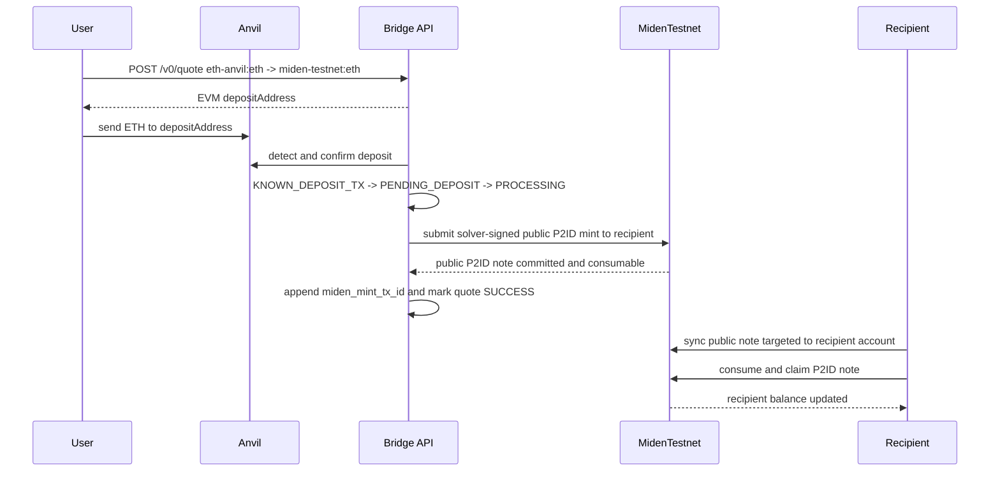
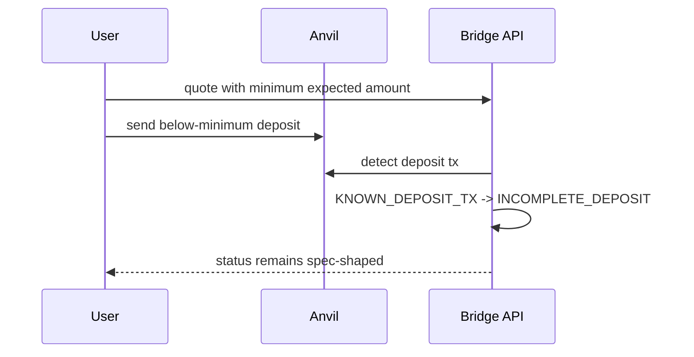
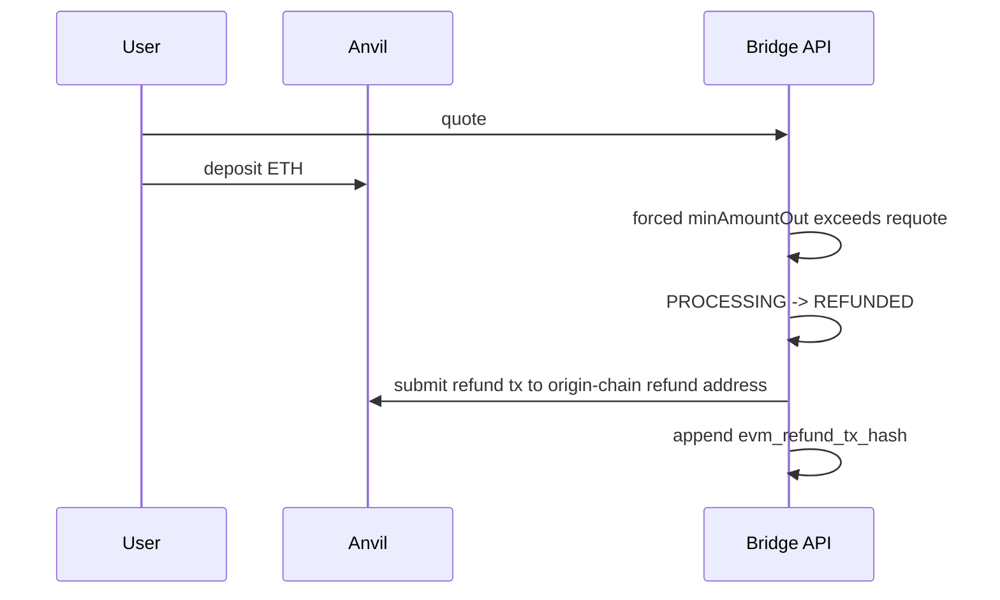
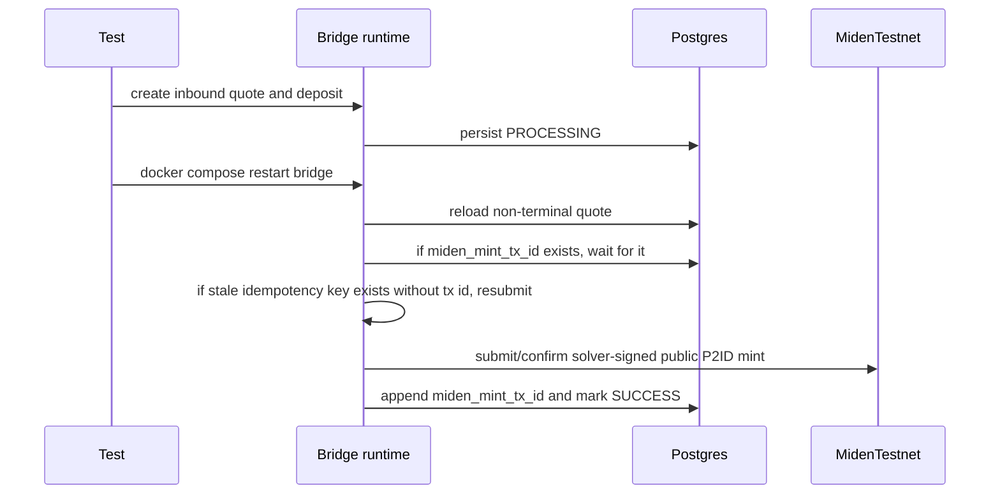

# E2E Handoff - Mock 1Click Anvil + Miden Testnet Sandbox

Snapshot: 2026-05-13.

## Current Status

- Repo: `BrianSeong99/miden-testnet-bridge`
- Branch: `brian/sepolia-integration`
- Product shape: mock NEAR Intents 1Click builder sandbox. Third-party apps
  should integrate against `/v0/tokens`, `/v0/quote`,
  `/v0/deposit/submit`, and `/v0/status`; `/demo/*` and `/lab` are local
  sandbox helpers only.
- Accepted Miden path: public Miden testnet at `https://rpc.testnet.miden.io`
- EVM path validated here: local Anvil
- Sepolia readiness: profile-aware `eth-sepolia:*` assets, native ETH quote
  support, Sepolia-only Compose target, and `/v0/deposit/submit` tx-hash
  confirmation are implemented. Live Sepolia is not validated until evidence
  includes public Sepolia tx hashes and final status responses.
- Local Miden node: legacy fallback only, not the acceptance path
- Full serialized E2E from the Sepolia-readiness run: `5 passed; 0 failed; finished in 934.77s`
- Builder sandbox smoke from this branch: inbound click/CLI flow, recipient
  claim, outbound funding, outbound public-note submit, and Anvil release all
  reached `SUCCESS`.
- Non-E2E regression set: green for `lib`, `evm`, `hardening`, `lifecycle`, `miden_bridge`, `miden_node`, `state`
- Static evidence page: [`docs/smoke-test-report.html`](./smoke-test-report.html)
- GitHub Pages URL: `https://brianseong99.github.io/miden-testnet-bridge/smoke-test-report.html`

The old per-quote Miden account design is no longer the plan. Miden-origin deposits use public programmable notes. The bridge consumes a valid `BridgeOutV1` note with a stable bridge account and releases on the destination chain after the Miden consume tx is confirmed.

## Reference Takeaways

Reviewed against:

- `0xMiden/agentic-template`
- `0xMiden/agent-tools`
- `0xMiden/protocol`

Design rules we are following:

- Use native Miden client network constructors. Testnet should go through `ClientBuilder::for_testnet()` semantics, not hand-assembled local-node defaults.
- Sync before account reads, note reads, transaction construction, and post-submit confirmation checks.
- Treat notes as the native Miden communication primitive. A two-party transfer is at least two transactions: create note, then consume note.
- Use `NoteType::Public` when the bridge needs discoverability. Public still requires a transaction/proof; it is not an instant off-chain message.
- Use durable tx ids as the recovery artifact. An idempotency key without a tx id is only evidence that work began, not evidence that a transaction was safely submitted.

## Runtime Shape

Default Compose now runs:

- `bridge`
- `postgres`
- `anvil`
- `anvil-init`

It does not start `miden-node` unless a caller explicitly uses the legacy `local-node` profile.

Important env:

```bash
MIDEN_RPC_URL=https://rpc.testnet.miden.io
MIDEN_MASTER_SEED_HEX=<unique 32-byte hex seed>
MIDEN_REMOTE_PROVER_URL=        # optional override; native testnet defaults work
MIDEN_REMOTE_PROVER_TIMEOUT_SECS=180
BRIDGE_PROFILE=anvil
BRIDGE_DEMO_ENABLED=1
BRIDGE_PRICER=mock              # E2E harness only
EVM_REQUIRED_CONFIRMATIONS=1
EVM_DEPOSIT_SCAN_LOOKBACK_BLOCKS=
```

The E2E harness now injects a unique `MIDEN_MASTER_SEED_HEX` per test and Compose forwards it into the bridge container. This matters on public testnet: reusing the default seed reused the same solver account and produced `incorrect account initial commitment` failures after the first run advanced that account on-chain.

Sepolia profile:

```bash
cp .env.sepolia.example .env
# Fill EVM_RPC_URL, MASTER_MNEMONIC, SOLVER_PRIVATE_KEY, and a fresh MIDEN_MASTER_SEED_HEX.
make sepolia
./bin/bridgectl quote inbound --asset eth --recipient <miden-address> --refund-to <sepolia-address>
```

In Sepolia mode, leave `EVM_DEPOSIT_SCAN_LOOKBACK_BLOCKS` empty. The bridge
waits for `/v0/deposit/submit`, then verifies the submitted tx hash pays the
quoted deposit address and has the configured confirmation depth. This avoids
RPC-heavy chain-history scans on public Sepolia.

## Builder Sandbox Smoke

The branch adds a one-command builder path:

```bash
cp .env.anvil.example .env
make sandbox
open http://localhost:8080/lab
./bin/bridgectl status
```

Runtime evidence from 2026-05-11:

```text
/healthz = 200 ok
/readyz = 200 ready
/demo/info: nearIntentsMock=true, runtimeProfile=anvil
tokens: eth-anvil:{eth,usdc,usdt,btc}, miden-testnet:{eth,usdc,usdt,btc}
```

Inbound click/CLI smoke:

```text
correlation_id=038088e0-c9bd-421d-909a-2b06adbbb038
recipient_account_id=0x9ead4197c4ac0b805d293f53a288e0
evm_deposit_tx=0x584c214334a5b01a0ecbd60b682c63332002185699a6b710ed54a0245a3e6990
miden_mint_tx=0x596419a82c59e174d7ee8b372079a6cb84d0be6395215bc6b13439757c08030c
claim_tx=0xc987caf66e7030b44227feed0abe7c897065a0c43ca9dadebf6d79a2f6d191dc
final_status=SUCCESS
```

Outbound click/CLI smoke:

```text
funding_correlation_id=933539eb-6da1-445e-a264-1170ff230ecc
outbound_correlation_id=1c1c3191-8a9f-44e5-bfbb-a99c0a91d349
public_bridge_note_tx=0x96c5e5efe76c4b5877e64ebf67e7ee8ee7db6165ef3159fa3b232098bdeaf8bb
solver_consume_tx=0xa6b0f520e19c4f318df7f9171d2ceba3b70b21847edf942e027c7d308f912b2a
evm_release_tx=0x2d9f766f6a66a785d645aff7b9fba1b0ae238a68f695afe5d50e7729fed81c0b
final_status=SUCCESS
```

## Flow: Inbound EVM To Miden



Evidence from full suite:

```text
E2E_EVIDENCE inbound correlation_id=3cbab06b-e388-46c2-a2eb-56e9c64ece10 evm_deposit_tx_hashes=["0x136cc1b31bba44984326d08940299c4d9788d5868f497e56d566735bedbc2fdd"] miden_mint_tx_ids=["0x07a9060a690f11da8f08fff2cf2af6666abc6a026f6be6c369ab9431c7f2a64e"] consumable_note_count=1
```

## Flow: Outbound Miden To EVM


Evidence from full suite:

```text
E2E_EVIDENCE outbound funding_correlation_id=1b3fa7ee-38e1-4e9f-9190-0ae8b24db149 outbound_correlation_id=9b642790-cb2e-4d30-bf76-a94d717dbb6f quote_hash=0x92fa8f84aac528651a0bf71d03c965a92132bad3c3e5e5636ff1945b065f9bb9 miden_consume_tx_ids=["0x52dc5f415da06b36e8f97b90f58a070e6b44e16e828659294bf8010040653c48"] evm_release_tx_hashes=["0x2d9f766f6a66a785d645aff7b9fba1b0ae238a68f695afe5d50e7729fed81c0b"] balance_delta=1000000000000
```

## Flow: Incomplete Deposit



Evidence from full suite:

```text
E2E_EVIDENCE incomplete correlation_id=70ab6db7-ee8e-4bca-855e-3c2e3ba9d2fe evm_deposit_tx_hashes=["0x1e96fd26e0f3d6efc6175c8ada196889d3d903552f1e4d38471f713de9064b8a"]
```

## Flow: Refund On Slippage



Evidence from full suite:

```text
E2E_EVIDENCE refund correlation_id=0c2f9355-6cd4-4150-b6ce-fe2b50882b0a evm_deposit_tx_hashes=["0xf47218334b0d5908260f0dfc503256bc7a26d5d3efaa117e0ec29a7bfb5eaa20"] evm_refund_tx_hashes=["0xf49feffd1be5d7b9067e354e8c4e445426ed7702fff57af7d2173cdb78bf004c"]
```

## Flow: Restart/Resume



The important fix here: a Miden idempotency key without a durable tx id is treated as interrupted pre-durable work. The bridge waits briefly for a tx id, then resubmits instead of exiting.

Evidence from full suite:

```text
E2E_EVIDENCE restart_resume correlation_id=46e070c8-f6a6-4298-b47a-df76a571604e evm_deposit_tx_hashes=["0xbad3d3f7c012e743bf98beaa64e83a24aa1a73028e34983148469ff33a632a26"] miden_mint_tx_ids=["0x1858d6d3d23d5eb60dee3863577a18c9067157eb6f1e4079864a01ad06eb292b"]
```

## Validation Commands

Full E2E:

```bash
RUSTFLAGS='-C debug-assertions=no' RUN_E2E=1 cargo test --test e2e -- --nocapture --test-threads=1
```

Result:

```text
test result: ok. 5 passed; 0 failed; 0 ignored; 0 measured; 0 filtered out; finished in 934.77s
```

Non-E2E regression:

```bash
cargo test --lib --test evm --test hardening --test lifecycle --test miden_bridge --test miden_node --test state
```

Result:

```text
35 lib tests passed
4 evm tests passed
4 hardening tests passed
13 lifecycle tests passed
5 miden_bridge tests passed
1 miden_node test passed
8 state tests passed
```

Formatting:

```bash
cargo fmt --check
```

Result: passed.

## What Changed In This Pivot

- `compose.yaml` defaults to Miden testnet and forwards `MIDEN_MASTER_SEED_HEX`.
- `src/main.rs` standalone default now matches testnet instead of localhost.
- `MidenClient` uses endpoint-aware native constructors (`for_testnet`, `for_devnet`, `for_localhost`) and supports optional remote prover override.
- `/v0/quote` returns a `BridgeOutV1` deposit memo for Miden-origin quotes.
- The outbound monitor validates and consumes public bridge notes instead of deriving per-quote accounts.
- Inbound Miden payout uses public P2ID notes so a separate client can discover the note.
- EVM release/refund and Miden mint/consume paths persist tx ids and emit structured evidence logs.
- Restart/resume tolerates stale pre-durable Miden idempotency keys.
- `make sandbox` starts the public Miden testnet + Anvil builder sandbox with a
  fresh seed when the placeholder is still present.
- `/lab` provides a clickable UI, embedded Mermaid diagrams, live flow cards,
  lifecycle events, and selected quote/tx artifacts.
- `./bin/bridgectl` provides status, quote, demo, flow, log, and reset commands
  for third-party builders and future agents.
- `/healthz` is local liveness; `/readyz` includes Miden RPC readiness and may
  transiently fail during public testnet RPC lag.

## Residual Risks

- This proves Miden testnet + Anvil, not Sepolia. Sepolia still needs funded solver liquidity, RPC config, token registry, and live tx evidence.
- `RUSTFLAGS='-C debug-assertions=no'` is still required for E2E. Keep this visible; do not hide it behind a green badge.
- Bootstrapping every E2E test creates fresh public testnet accounts and faucets, so the suite is slow by design.
- Public notes are intentionally discoverable. This matches Brian's production preference, but quote privacy is not the point of this v0.
- The stable bridge account is v0. A later network-account consumer can replace it without changing the public-note deposit primitive.

## Next Milestone

`v0.3` is Sepolia validation:

1. Configure Sepolia RPC, chain id, solver key, and test token registry.
2. Fund the EVM solver/release side and verify balance deltas.
3. Run inbound Sepolia -> Miden testnet.
4. Run outbound Miden testnet public note -> Sepolia.
5. Capture issue comments with quote payloads, tx ids, lifecycle rows, bridge logs, and final status responses.
