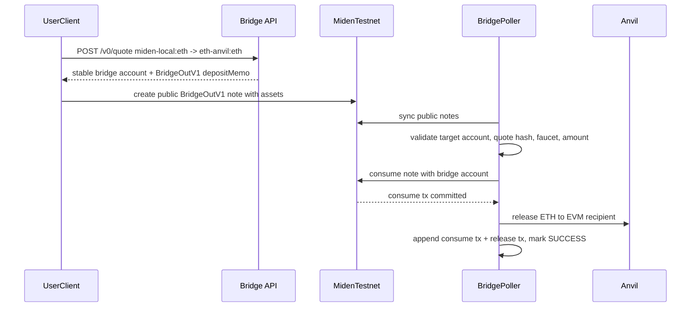
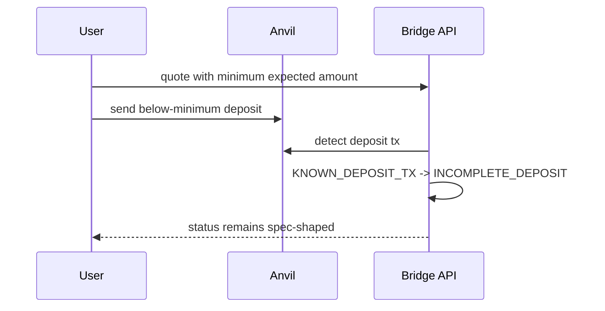
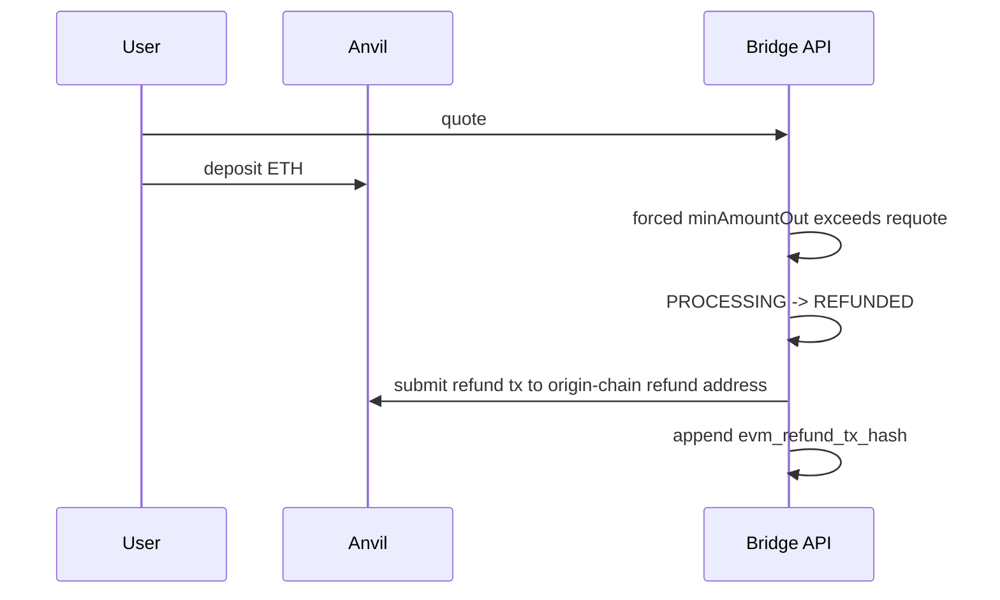
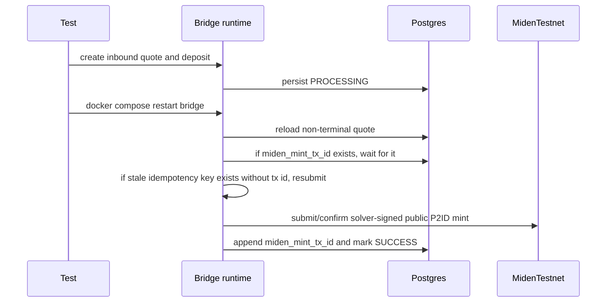

# E2E Handoff - `chore/13-testnet-pivot`

Snapshot: 2026-05-05.

## Current Status

- Repo: `BrianSeong99/miden-testnet-bridge`
- Branch: `chore/13-testnet-pivot`
- Accepted Miden path: public Miden testnet at `https://rpc.testnet.miden.io`
- EVM path validated here: local Anvil
- Local Miden node: legacy fallback only, not the acceptance path
- Full serialized E2E: `5 passed; 0 failed; finished in 822.50s`
- Non-E2E regression set: green for `lib`, `evm`, `hardening`, `lifecycle`, `miden_bridge`, `miden_node`, `state`
- Static evidence page: [`docs/smoke-test-report.html`](./smoke-test-report.html)
- GitHub Pages URL: `https://brianseong99.github.io/miden-testnet-bridge/smoke-test-report.html`

The old per-quote Miden account design is no longer the plan. Miden-origin deposits use public programmable notes. The bridge consumes a valid `BridgeOutV1` note with a stable bridge account and releases on the destination chain after the Miden consume tx is confirmed.

## Reference Takeaways

Reviewed against:

- `0xMiden/agentic-template`
- `0xMiden/agent-tools`
- `0xMiden/protocol`

Design rules we are following:

- Use native Miden client network constructors. Testnet should go through `ClientBuilder::for_testnet()` semantics, not hand-assembled local-node defaults.
- Sync before account reads, note reads, transaction construction, and post-submit confirmation checks.
- Treat notes as the native Miden communication primitive. A two-party transfer is at least two transactions: create note, then consume note.
- Use `NoteType::Public` when the bridge needs discoverability. Public still requires a transaction/proof; it is not an instant off-chain message.
- Use durable tx ids as the recovery artifact. An idempotency key without a tx id is only evidence that work began, not evidence that a transaction was safely submitted.

## Runtime Shape

Default Compose now runs:

- `bridge`
- `postgres`
- `anvil`
- `anvil-init`

It does not start `miden-node` unless a caller explicitly uses the legacy `local-node` profile.

Important env:

```bash
MIDEN_RPC_URL=https://rpc.testnet.miden.io
MIDEN_MASTER_SEED_HEX=<unique 32-byte hex seed>
MIDEN_REMOTE_PROVER_URL=        # optional override; native testnet defaults work
MIDEN_REMOTE_PROVER_TIMEOUT_SECS=10
BRIDGE_PRICER=mock              # E2E harness only
```

The E2E harness now injects a unique `MIDEN_MASTER_SEED_HEX` per test and Compose forwards it into the bridge container. This matters on public testnet: reusing the default seed reused the same solver account and produced `incorrect account initial commitment` failures after the first run advanced that account on-chain.

## Flow: Inbound EVM To Miden


Evidence from full suite:

```text
E2E_EVIDENCE inbound correlation_id=862a5ab0-9634-4e8a-85f6-8c336983d55f evm_deposit_tx_hashes=["0xe95cb1ab8a3e329f37283de16fd6425a98a1a9ff38e7af1dab176678ad197aeb"] miden_mint_tx_ids=["0x73aa5dce46f60e4b267c69361eb459d64b93297110e7d73186c14a1dafa99ac2"] consumable_note_count=1
```

## Flow: Outbound Miden To EVM



Evidence from full suite:

```text
E2E_EVIDENCE outbound funding_correlation_id=787bb932-965a-4f07-bca0-40474caabf6a outbound_correlation_id=3f5141a5-79b1-47fb-9225-c12bddc68b2b quote_hash=0xad4a14889b226f7de0cabff6371d7058606e03ca165b325cf9b5400c23741259 miden_consume_tx_ids=["0x65af9db10ea57f4c7934d024b6e5b8ccfc7881189a2f650b53eaff726360ea62"] evm_release_tx_hashes=["0x2d9f766f6a66a785d645aff7b9fba1b0ae238a68f695afe5d50e7729fed81c0b"] balance_delta=1000000000000
```

## Flow: Incomplete Deposit



Evidence from full suite:

```text
E2E_EVIDENCE incomplete correlation_id=c26ca708-2348-49e8-b3bd-ae36fc9838eb evm_deposit_tx_hashes=["0x63041961b5f9c066c2729db2556551cadb3f77491b8d4e3e54ce50434eb97daa"]
```

## Flow: Refund On Slippage



Evidence from full suite:

```text
E2E_EVIDENCE refund correlation_id=dd094af4-73f6-40c0-bb86-2eea34cc7d06 evm_deposit_tx_hashes=["0xb4beae8830c684109e22a9fc37d30ff2acad26806d412ec8275abaf2a81abdaf"] evm_refund_tx_hashes=["0xa435edec34875647ccecef0358a8a437a47173152fafcb9e07d3dd97cde802f4"]
```

## Flow: Restart/Resume



The important fix here: a Miden idempotency key without a durable tx id is treated as interrupted pre-durable work. The bridge waits briefly for a tx id, then resubmits instead of exiting.

Evidence from full suite:

```text
E2E_EVIDENCE restart_resume correlation_id=482ee24d-9c04-4a0a-8cf0-11fa270aaeec evm_deposit_tx_hashes=["0x5c831f42cf38944fef3c5ca0b926218d1277257af4db8bf72a7dd5ce10f6e656"] miden_mint_tx_ids=["0x276c72b9ff2919a4e8072fe08828cd28e96aa2b1e64ffcda5a6ba551a5e92898"]
```

## Validation Commands

Full E2E:

```bash
RUSTFLAGS='-C debug-assertions=no' RUN_E2E=1 cargo test --test e2e -- --nocapture --test-threads=1
```

Result:

```text
test result: ok. 5 passed; 0 failed; 0 ignored; 0 measured; 0 filtered out; finished in 822.50s
```

Non-E2E regression:

```bash
cargo test --lib --test evm --test hardening --test lifecycle --test miden_bridge --test miden_node --test state
```

Result:

```text
34 lib tests passed
4 evm tests passed
4 hardening tests passed
13 lifecycle tests passed
5 miden_bridge tests passed
1 miden_node test passed
8 state tests passed
```

Formatting:

```bash
cargo fmt --check
```

Result: passed.

## What Changed In This Pivot

- `compose.yaml` defaults to Miden testnet and forwards `MIDEN_MASTER_SEED_HEX`.
- `src/main.rs` standalone default now matches testnet instead of localhost.
- `MidenClient` uses endpoint-aware native constructors (`for_testnet`, `for_devnet`, `for_localhost`) and supports optional remote prover override.
- `/v0/quote` returns a `BridgeOutV1` deposit memo for Miden-origin quotes.
- The outbound monitor validates and consumes public bridge notes instead of deriving per-quote accounts.
- Inbound Miden payout uses public P2ID notes so a separate client can discover the note.
- EVM release/refund and Miden mint/consume paths persist tx ids and emit structured evidence logs.
- Restart/resume tolerates stale pre-durable Miden idempotency keys.

## Residual Risks

- This proves Miden testnet + Anvil, not Sepolia. Sepolia still needs funded solver liquidity, RPC config, token registry, and live tx evidence.
- `RUSTFLAGS='-C debug-assertions=no'` is still required for E2E. Keep this visible; do not hide it behind a green badge.
- Bootstrapping every E2E test creates fresh public testnet accounts and faucets, so the suite is slow by design.
- Public notes are intentionally discoverable. This matches Brian's production preference, but quote privacy is not the point of this v0.
- The stable bridge account is v0. A later network-account consumer can replace it without changing the public-note deposit primitive.

## Next Milestone

`v0.3` is Sepolia validation:

1. Configure Sepolia RPC, chain id, solver key, and test token registry.
2. Fund the EVM solver/release side and verify balance deltas.
3. Run inbound Sepolia -> Miden testnet.
4. Run outbound Miden testnet public note -> Sepolia.
5. Capture issue comments with quote payloads, tx ids, lifecycle rows, bridge logs, and final status responses.
