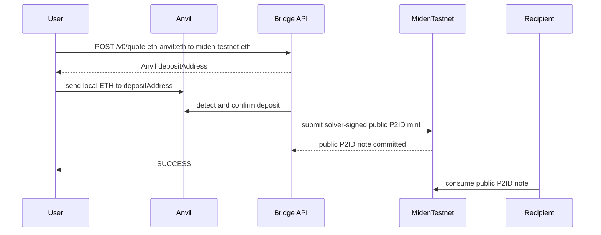
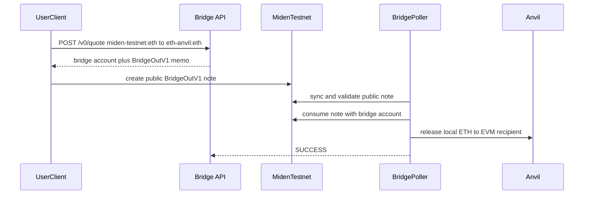

# Local Anvil Sandbox

> Testnet only: this is a local-only helper profile for mock assets, Anvil, and
> public Miden testnet. It is not the default builder guide, not a production
> bridge, not a mainnet integration path, and must not be used with mainnet
> funds.

Use this profile when you want the fully clickable `/lab` demo or deterministic
local EVM regression behavior. For third-party builders testing public evidence
or Sepolia behavior, use [`../builder-testing-guide.md`](../builder-testing-guide.md).

## What This Profile Runs

```text
local Anvil EVM + public Miden testnet + mock NEAR Intents 1Click API
```

It starts:

- `bridge` at `http://localhost:8080`
- `postgres`
- `anvil`
- `anvil-init`, which deploys mock ERC20 assets
- `/lab`, a local browser helper that calls `/demo/*`

`/demo/*` exists only to automate local demo transactions. App integrations
should still use `/v0/tokens`, `/v0/quote`, `/v0/deposit/submit`, and
`/v0/status`.

## Start

```bash
git clone https://github.com/BrianSeong99/miden-testnet-bridge.git
cd miden-testnet-bridge
cp .env.anvil.example .env
make sandbox
```

Expected output:

```text
Bridge API: http://localhost:8080
Lab UI:     http://localhost:8080/lab
CLI:        ./bin/bridgectl status
```

Open:

```text
http://localhost:8080/lab
```

## Check

```bash
curl -i http://localhost:8080/healthz
curl -i http://localhost:8080/readyz
./bin/bridgectl status
./bin/bridgectl tokens
```

The Anvil profile advertises:

```text
eth-anvil:eth
eth-anvil:usdc
eth-anvil:usdt
eth-anvil:btc
miden-testnet:eth
miden-testnet:usdc
miden-testnet:usdt
miden-testnet:btc
```

## Demo Flows

Inbound, Anvil to Miden:

```bash
./bin/bridgectl demo inbound --asset eth --amount 1000000000000
./bin/bridgectl demo claim <recipient-account-id>
```

Outbound setup and submit, Miden to Anvil:

```bash
./bin/bridgectl demo outbound-fund --asset eth --amount 1000000000000
./bin/bridgectl demo outbound-submit <sender-account-id> --asset eth --amount 1000000000000
```

Inspect:

```bash
./bin/bridgectl flows
./bin/bridgectl flow <correlation-id>
make sandbox-logs
```

Reset:

```bash
make sandbox-reset
```

Use a fresh `MIDEN_MASTER_SEED_HEX` after reset if the previous public Miden
testnet account state has advanced.

## Flow Shape





## Troubleshooting

If the bridge does not see Anvil deposits:

```bash
docker compose ps
docker compose logs bridge --tail=200 | rg "deposit|EVM|anvil|missing token"
docker compose exec bridge printenv EVM_RPC_URL BRIDGE_PROFILE
docker compose exec anvil cast rpc eth_blockNumber --rpc-url http://localhost:8545
```

If token contracts are missing:

```bash
docker compose up --build --abort-on-container-exit --exit-code-from anvil-init anvil-init
docker compose restart bridge
```
