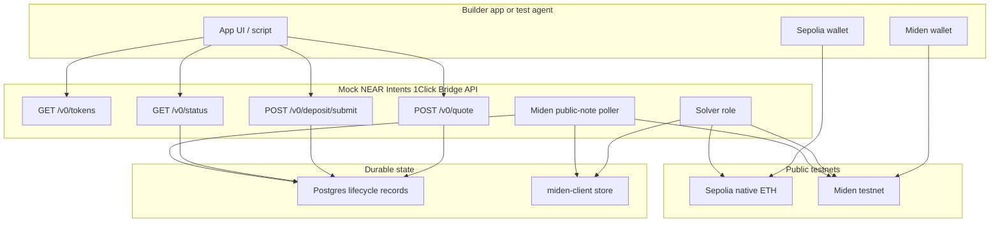
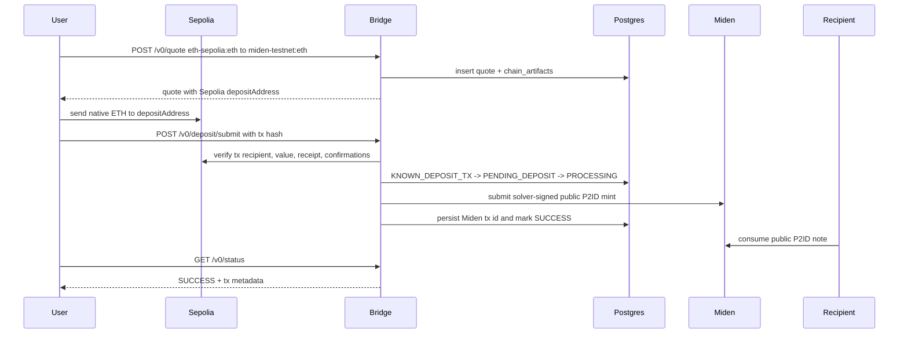
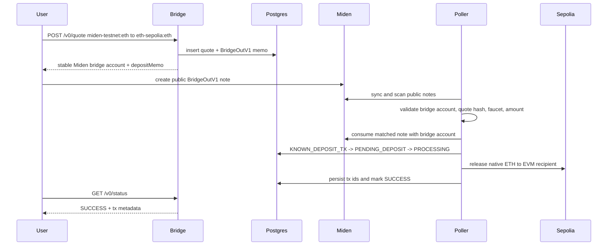

# Architecture

> Testnet only: this architecture describes the Sepolia and public Miden
> testnet mock bridge path. It is not a production bridge or a mainnet
> integration path.

## Component Model

## Inbound: Sepolia To Miden

## Outbound: Miden To Sepolia

## Anvil Fallback

The local Anvil profile follows the same logical shape with `eth-anvil:*`
assets and local EVM transactions. It is documented separately in
[`anvil/local-sandbox.md`](anvil/local-sandbox.md).
