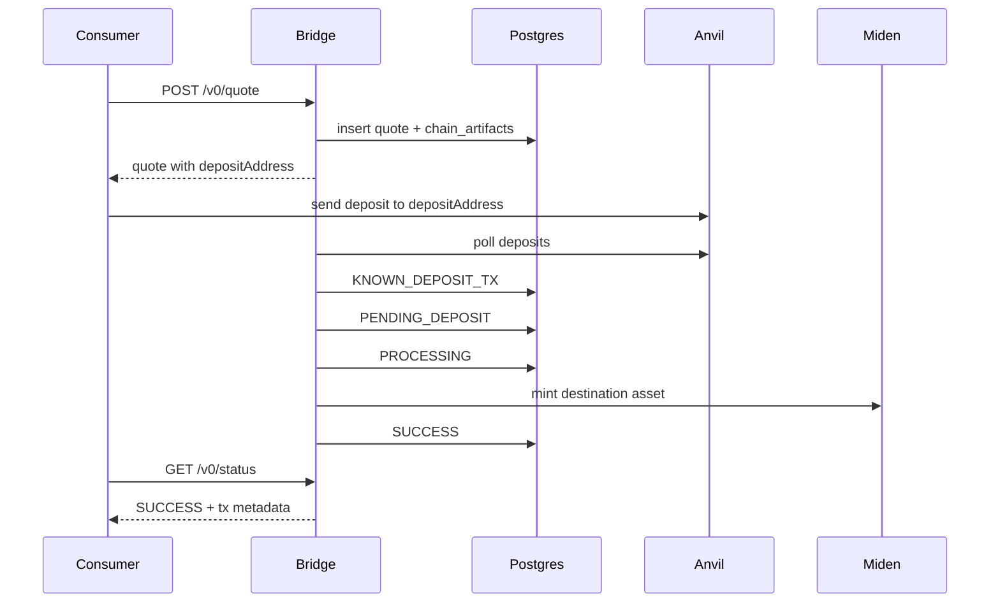
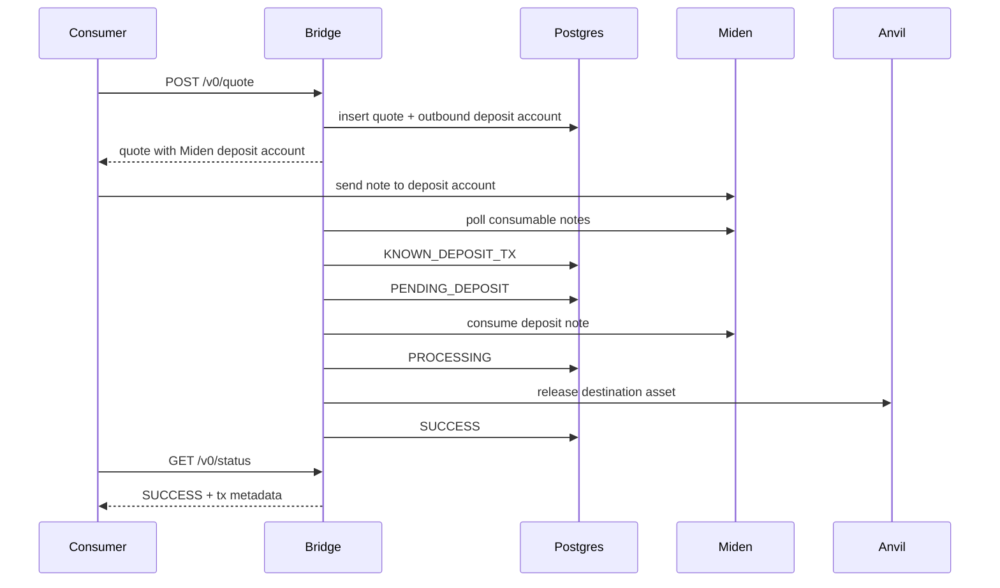

# Architecture

## Inbound: Anvil to Miden

```mermaid
sequenceDiagram
    participant Consumer
    participant Bridge
    participant Postgres
    participant Anvil
    participant Miden

    Consumer->>Bridge: POST /v0/quote
    Bridge->>Postgres: insert quote + chain_artifacts
    Bridge-->>Consumer: quote with depositAddress
    Consumer->>Anvil: send deposit to depositAddress
    Bridge->>Anvil: poll deposits
    Bridge->>Postgres: KNOWN_DEPOSIT_TX
    Bridge->>Postgres: PENDING_DEPOSIT
    Bridge->>Postgres: PROCESSING
    Bridge->>Miden: mint destination asset
    Bridge->>Postgres: SUCCESS
    Consumer->>Bridge: GET /v0/status
    Bridge-->>Consumer: SUCCESS + tx metadata
```

## Outbound: Miden to Anvil

```mermaid
sequenceDiagram
    participant Consumer
    participant Bridge
    participant Postgres
    participant Miden
    participant Anvil

    Consumer->>Bridge: POST /v0/quote
    Bridge->>Postgres: insert quote + outbound deposit account
    Bridge-->>Consumer: quote with Miden deposit account
    Consumer->>Miden: send note to deposit account
    Bridge->>Miden: poll consumable notes
    Bridge->>Postgres: KNOWN_DEPOSIT_TX
    Bridge->>Postgres: PENDING_DEPOSIT
    Bridge->>Miden: consume deposit note
    Bridge->>Postgres: PROCESSING
    Bridge->>Anvil: release destination asset
    Bridge->>Postgres: SUCCESS
    Consumer->>Bridge: GET /v0/status
    Bridge-->>Consumer: SUCCESS + tx metadata
```
