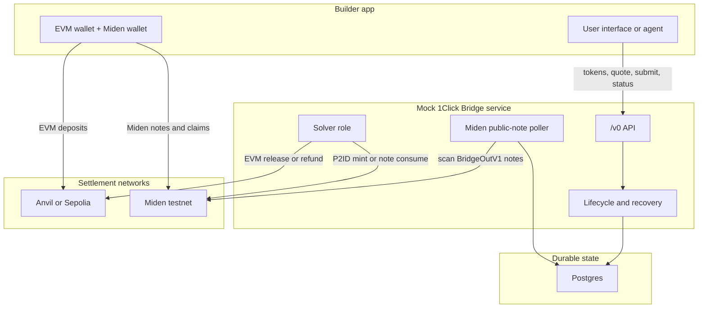

# Builder Testing Guide

> Testnet only: this repository is a mock NEAR Intents 1Click builder sandbox
> for local testing, Anvil, Sepolia, and public Miden testnet. It is not a
> production bridge, it is not a mainnet integration path, and it must not be
> used with mainnet funds.

This guide walks through using `miden-testnet-bridge` as a local mock of the
NEAR Intents 1Click API for apps that want to test Miden bridge flows.

The default path is:

```text
local Anvil EVM + public Miden testnet + mock 1Click Bridge API
```

Use this when you want your app, script, or agent to exercise the same
quote/deposit/status shape it will use against a hosted 1Click service, while
settling test assets through public notes on Miden testnet.

## What You Will Run

By the end of this guide you will have:

1. A local Bridge API at `http://localhost:8080`.
2. A local Anvil EVM chain with mock ETH and mock ERC20 assets.
3. Public Miden testnet settlement through native `miden-client` behavior.
4. A clickable lab at `http://localhost:8080/lab`.
5. CLI commands for quotes, demo flows, status checks, logs, and reset.
6. The `/v0/*` endpoints your app should integrate with:

```text
GET  /v0/tokens
POST /v0/quote
POST /v0/deposit/submit
GET  /v0/status
```

The `/demo/*` endpoints and `/lab` page are local sandbox helpers. Use them to
learn and smoke test the flow. Do not make a third-party app depend on them.

## Mental Model

The repo is a testnet-only mock NEAR Intents 1Click bridge, not the real NEAR
solver network. The public API shape is intentionally 1Click-like, while the
settlement logic is specialized for Anvil, Sepolia, and Miden testnet.



Inbound means EVM to Miden:

1. Your app asks the Bridge API for a quote.
2. The user sends EVM funds to the returned deposit address.
3. The bridge detects or verifies the deposit.
4. The solver role creates a public Miden P2ID payout note.
5. The recipient Miden wallet consumes that note.

Outbound means Miden to EVM:

1. Your app asks the Bridge API for a quote.
2. The Bridge API returns a stable Miden bridge account and `BridgeOutV1` memo.
3. The user creates a public Miden note targeted to that bridge account.
4. The bridge poller validates and consumes the note.
5. The solver role releases EVM funds to the destination recipient.

In this mock, the solver role runs inside the bridge service. It owns the Miden
solver account and the EVM solver key. Treat it as a role boundary even though
it is not a separate process here.

## Prerequisites

Install these on the host:

- Docker with Compose v2.
- Rust toolchain compatible with this repo.
- OpenSSL, used to generate a fresh Miden seed.
- `curl`.
- `jq`, optional but useful for inspecting JSON.
- Network access to `https://rpc.testnet.miden.io`.

You do not need to run a local Miden node. The supported path uses public Miden
testnet and the native Miden remote prover configuration.

## Tutorial 1: Start The Local Builder Sandbox

Clone the repo:

```bash
git clone https://github.com/BrianSeong99/miden-testnet-bridge.git
cd miden-testnet-bridge
```

Create the Anvil sandbox environment:

```bash
cp .env.anvil.example .env
```

Start the stack:

```bash
make sandbox
```

`make sandbox` does three things:

1. Generates a fresh `MIDEN_MASTER_SEED_HEX` if `.env` still has the placeholder.
2. Starts `bridge`, `postgres`, `anvil`, and `anvil-init`.
3. Waits for health checks before printing the local URLs.

Expected output shape:

```text
Bridge API: http://localhost:8080
Lab UI:     http://localhost:8080/lab
CLI:        ./bin/bridgectl status
```

Bootstrap can take a few minutes because the bridge deploys and funds Miden
testnet accounts. Wait for `make sandbox` to finish before testing.

## Tutorial 2: Check The Service

Check bridge health:

```bash
curl -i http://localhost:8080/healthz
curl -i http://localhost:8080/readyz
```

Expected result:

```text
HTTP/1.1 200 OK
```

Inspect the mock 1Click token list:

```bash
curl -s http://localhost:8080/v0/tokens | jq .
```

The Anvil profile advertises assets with these prefixes:

```text
eth-anvil:eth
eth-anvil:usdc
eth-anvil:usdt
eth-anvil:btc
miden-testnet:eth
miden-testnet:usdc
miden-testnet:usdt
miden-testnet:btc
```

Check the same state through the local CLI:

```bash
./bin/bridgectl status
./bin/bridgectl tokens
```

## Tutorial 3: Use The Clickable Lab

Open:

```text
http://localhost:8080/lab
```

Use the lab to click through both directions:

- Anvil -> Miden: quote, EVM deposit, public P2ID mint, recipient claim.
- Miden -> Anvil: fund user Miden account, create public `BridgeOutV1` note,
  bridge consume, EVM release.

The lab calls `/demo/*` helper endpoints because a browser cannot safely sign
all EVM and Miden transactions itself. It is for learning and local smoke
testing. Your app should use `/v0/*`.

## Tutorial 4: Run The Same Flows From The CLI

Start an inbound demo flow:

```bash
./bin/bridgectl demo inbound --asset eth --amount 1000000000000
```

The response includes:

- `correlationId`
- `recipientAccountId`
- an Anvil deposit tx hash
- a Miden mint tx id after settlement
- `status`

If the response gives you a `recipientAccountId`, claim the public P2ID note:

```bash
./bin/bridgectl demo claim <recipient-account-id>
```

Start the outbound setup step. This funds a user Miden account so it can create
the outbound note:

```bash
./bin/bridgectl demo outbound-fund --asset eth --amount 1000000000000
```

Then submit the outbound public Miden note from that user account:

```bash
./bin/bridgectl demo outbound-submit <sender-account-id> --asset eth --amount 1000000000000
```

Inspect all demo flows:

```bash
./bin/bridgectl flows
./bin/bridgectl flow <correlation-id>
```

Tail bridge logs:

```bash
make sandbox-logs
```

Reset local state:

```bash
make sandbox-reset
```

Use reset when you want a clean Postgres database, clean Anvil state, and clean
Miden client store. A clean public Miden run should also use a fresh
`MIDEN_MASTER_SEED_HEX`.

## Tutorial 5: Integrate Your App Against `/v0/*`

Set your app's bridge base URL to:

```text
http://localhost:8080
```

Do not use `/demo/*` from application code. Use only:

```text
GET  /v0/tokens
POST /v0/quote
POST /v0/deposit/submit
GET  /v0/status
```

### Fetch supported tokens

```bash
curl -s http://localhost:8080/v0/tokens | jq .
```

Use the returned `assetId` values in quote requests.

### Request an inbound quote: EVM to Miden

Use this when the user starts with EVM funds and wants a Miden payout.

Replace:

- `<miden-recipient-address>` with a valid Miden account address from your app.
- `<evm-refund-address>` with the user's EVM refund address.

```bash
curl -s http://localhost:8080/v0/quote \
  -H 'content-type: application/json' \
  -d '{
    "dry": false,
    "depositMode": "SIMPLE",
    "swapType": "EXACT_INPUT",
    "slippageTolerance": 100.0,
    "originAsset": "eth-anvil:eth",
    "depositType": "ORIGIN_CHAIN",
    "destinationAsset": "miden-testnet:eth",
    "amount": "1000000000000",
    "refundTo": "<evm-refund-address>",
    "refundType": "ORIGIN_CHAIN",
    "recipient": "<miden-recipient-address>",
    "recipientType": "DESTINATION_CHAIN",
    "deadline": "2027-01-01T00:00:00Z"
  }' | jq .
```

Save these fields from the response:

```text
correlationId
quote.depositAddress
quote.amountIn
quote.amountOut
```

Your app must send the EVM deposit to `quote.depositAddress`. In the Anvil
profile, the bridge scans Anvil and detects deposits. In the Sepolia profile,
submit the transaction hash through `/v0/deposit/submit` after the tx lands.

Poll status by deposit address:

```bash
curl -s "http://localhost:8080/v0/status?depositAddress=<deposit-address>" | jq .
```

Terminal statuses are:

```text
SUCCESS
REFUNDED
FAILED
```

For inbound Miden payouts, `SUCCESS` means the public P2ID payout note is
committed and consumable. The recipient wallet still needs to sync and consume
that note to update its local balance.

### Request an outbound quote: Miden to EVM

Use this when the user starts with Miden funds and wants an EVM payout.

Replace:

- `<evm-recipient-address>` with the destination EVM address.
- `<miden-refund-address>` with the user's Miden refund address.

```bash
curl -s http://localhost:8080/v0/quote \
  -H 'content-type: application/json' \
  -d '{
    "dry": false,
    "depositMode": "SIMPLE",
    "swapType": "EXACT_INPUT",
    "slippageTolerance": 100.0,
    "originAsset": "miden-testnet:eth",
    "depositType": "ORIGIN_CHAIN",
    "destinationAsset": "eth-anvil:eth",
    "amount": "1000000000000",
    "refundTo": "<miden-refund-address>",
    "refundType": "ORIGIN_CHAIN",
    "recipient": "<evm-recipient-address>",
    "recipientType": "DESTINATION_CHAIN",
    "deadline": "2027-01-01T00:00:00Z"
  }' | jq .
```

Save these fields:

```text
correlationId
quote.depositAddress
quote.depositMemo
```

For outbound Miden deposits:

- `quote.depositAddress` is the Miden bridge account.
- `quote.depositMemo` is a `BridgeOutV1` instruction payload.
- The user creates a public Miden note carrying the quoted asset and memo.
- The bridge poller scans public notes, validates the memo, consumes the note
  with the bridge account, and releases EVM funds.

Reference implementations in this repo:

- `src/bin/sepolia_e2e.rs` for a full `/v0/*` Sepolia native ETH run.
- `src/api/demo.rs` for local demo helper flows.
- `src/chains/miden_bridge_note.rs` for `BridgeOutV1` memo encoding.

Poll status with both deposit fields:

```bash
curl -G http://localhost:8080/v0/status \
  --data-urlencode "depositAddress=<miden-bridge-account-address>" \
  --data-urlencode "depositMemo=<deposit-memo>" | jq .
```

## Tutorial 6: Run Live Sepolia Native ETH

Use Sepolia only when you need public Etherscan evidence or want to test against
a public EVM testnet. The local Anvil sandbox is the normal builder path.

Create the Sepolia env file:

```bash
cp .env.sepolia.example .env
```

Fill:

```text
EVM_RPC_URL
MASTER_MNEMONIC
SOLVER_PRIVATE_KEY
DEMO_EVM_FUNDED_PRIVATE_KEY
MIDEN_MASTER_SEED_HEX
```

Notes:

- `SOLVER_PRIVATE_KEY` must have enough Sepolia ETH to pay releases and gas.
- `DEMO_EVM_FUNDED_PRIVATE_KEY` is only needed for the live evidence runner or
  demo-style sender behavior.
- Use a fresh 32-byte `MIDEN_MASTER_SEED_HEX` for each clean public testnet run.
- Leave `EVM_DEPOSIT_SCAN_LOOKBACK_BLOCKS=` empty in Sepolia mode.

Start Sepolia mode:

```bash
make sepolia
```

Check:

```bash
./bin/bridgectl status
./bin/bridgectl tokens
```

Run the live Sepolia native ETH evidence runner:

```bash
RUSTFLAGS='-C debug-assertions=no' cargo run --bin sepolia_e2e 2>&1 | tee sepolia-e2e-live.log
```

The runner drives:

1. Sepolia ETH -> Miden public P2ID mint -> recipient claim.
2. Sepolia ETH funding for a user Miden source account -> public `BridgeOutV1`
   note -> bridge consume -> Sepolia ETH release.

The runner prints `SEPOLIA_E2E_EVIDENCE` lines with correlation ids, Sepolia tx
hashes, Miden tx ids, and balance delta. Keep those lines when sharing evidence.

Current public testnet report:

```text
https://brianseong99.github.io/miden-testnet-bridge/smoke-test-report.html
```

## Agent Runbook

Use this checklist when another agent or script needs to reproduce the sandbox.

1. Start clean:

```bash
git status --short --branch
cp .env.anvil.example .env
make sandbox-reset || true
make sandbox
```

2. Verify health:

```bash
curl -i http://localhost:8080/healthz
curl -i http://localhost:8080/readyz
./bin/bridgectl status
```

3. Smoke test one click path:

```bash
./bin/bridgectl demo inbound --asset eth --amount 1000000000000
./bin/bridgectl flows
```

4. Capture evidence:

```bash
./bin/bridgectl flow <correlation-id>
docker compose --env-file .env logs bridge --tail=300
```

5. Reset after the run:

```bash
make sandbox-reset
```

For full regression evidence:

```bash
cargo fmt --check
cargo test --lib --test evm --test hardening --test lifecycle --test miden_bridge --test miden_node --test state
RUSTFLAGS='-C debug-assertions=no' RUN_E2E=1 cargo test --test e2e -- --nocapture --test-threads=1
```

Do not claim Sepolia validation unless the evidence includes live Sepolia tx
hashes and final `SUCCESS` statuses for both directions.

## Troubleshooting

### `readyz` returns `503`

The bridge may still be bootstrapping Miden testnet accounts or waiting on RPC
lag. Give it the full Compose startup window, then check logs:

```bash
make sandbox-logs
```

### `incorrect account initial commitment`

You reused a Miden seed after the deterministic solver account advanced on
public testnet. Reset local state and use a fresh seed:

```bash
make sandbox-reset
cp .env.anvil.example .env
perl -0pi -e "s/MIDEN_MASTER_SEED_HEX=.*/MIDEN_MASTER_SEED_HEX=$(openssl rand -hex 32)/" .env
make sandbox
```

### Sepolia deposits do not move

Sepolia mode does not scan from genesis. After sending the EVM deposit, submit
the real transaction hash:

```bash
curl -s http://localhost:8080/v0/deposit/submit \
  -H 'content-type: application/json' \
  -d '{"txHash":"0x...","depositAddress":"0x..."}' | jq .
```

### Outbound quote succeeds but nothing releases

Check that the user created a public Miden `BridgeOutV1` note using exactly the
returned `quote.depositAddress`, `quote.depositMemo`, faucet, and amount.

Then inspect:

```bash
./bin/bridgectl flows
make sandbox-logs
```

### Browser app cannot call the bridge

Set CORS in `.env`:

```text
BRIDGE_CORS_ALLOW_ORIGIN=*
```

For tighter local testing, replace `*` with your app origin.

## Where To Look Next

- `README.md`: quick start, environment reference, evidence commands.
- `docs/E2E_HANDOFF.md`: implementation status, evidence ids, design decisions.
- `docs/RUNBOOK.md`: operator recovery procedures.
- `docs/smoke-test-report.html`: published Sepolia evidence page.
- `docs/openapi.yaml`: 1Click-shaped API schema vendored for this mock.
