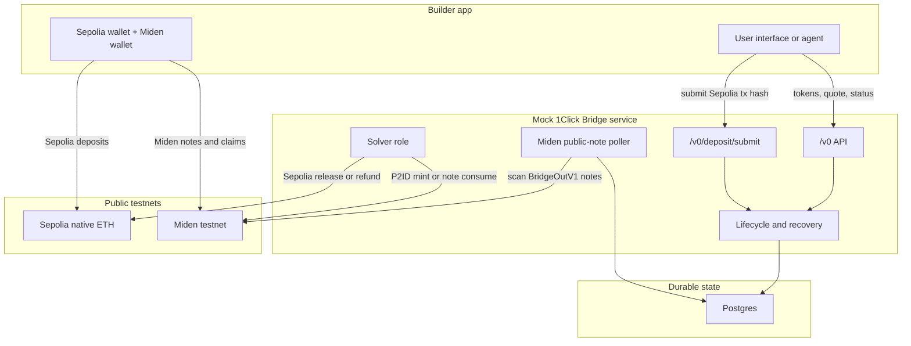

# Builder Testing Guide

> Testnet only: this repository is a mock NEAR Intents 1Click builder sandbox
> for Sepolia and public Miden testnet. It is not a production bridge, it is not
> a mainnet integration path, and it must not be used with mainnet funds.

This guide walks through the default builder path for `miden-testnet-bridge`:

```text
Sepolia native ETH + public Miden testnet + mock NEAR Intents 1Click API
```

Use this path when you want an app, script, or agent to exercise the same
quote/deposit/status shape it will use against a hosted 1Click service while
producing public testnet evidence.

## What You Will Run

By the end of this guide you will have:

1. A local Bridge API at `http://localhost:8080`.
2. A Sepolia-native-ETH mock 1Click bridge profile.
3. Public Miden testnet settlement through native `miden-client` behavior.
4. CLI commands for quotes, status checks, logs, and reset.
5. A live evidence runner for Sepolia-to-Miden and Miden-to-Sepolia.
6. The `/v0/*` endpoints your app should integrate with:

```text
GET  /v0/tokens
POST /v0/quote
POST /v0/deposit/submit
GET  /v0/status
```

`/demo/*` and the fully clickable lab UI are Sepolia testnet helpers for local
walkthroughs. Do not make a third-party app depend on them.

## Mental Model

The repo is a testnet-only mock NEAR Intents 1Click bridge, not the real NEAR
solver network. The public API shape is intentionally 1Click-like, while the
settlement logic is specialized for Sepolia native ETH and Miden testnet.



Inbound means Sepolia to Miden:

1. Your app asks the Bridge API for a quote.
2. The user sends Sepolia ETH to the returned deposit address.
3. Your app submits the landed Sepolia tx hash to `/v0/deposit/submit`.
4. The bridge verifies that tx and creates a public Miden P2ID payout note.
5. The recipient Miden wallet consumes that note.

Outbound means Miden to Sepolia:

1. Your app asks the Bridge API for a quote.
2. The Bridge API returns a stable Miden bridge account and `BridgeOutV1` memo.
3. The user creates a public Miden note targeted to that bridge account.
4. The bridge poller validates and consumes the note.
5. The solver role releases Sepolia ETH to the destination recipient.

In this mock, the solver role runs inside the bridge service. It owns the Miden
solver account and the Sepolia solver key. Treat it as a role boundary even
though it is not a separate process here.

AggLayer Miden-to-Sepolia is different from the mock NEAR Intents outbound
path. AggLayer does not auto-claim the L1 side in this helper. After submitting
the B2AGG note, poll the Gateway FM `/bridges/{sepolia-address}` endpoint for a
Miden-origin row with `ready_for_claim=true`, `dest_net=0`, and empty
`claim_tx_hash`. The `/claims/{sepolia-address}` endpoint is claim history, not
readiness; it can stay empty while a manual `claimAsset` transaction is already
available to submit.

## Prerequisites

Install these on the host:

- Docker with Compose v2.
- Rust toolchain compatible with this repo.
- OpenSSL, used to generate a fresh Miden seed.
- `curl`.
- `jq`, optional but useful for inspecting JSON.
- Network access to `https://rpc.testnet.miden.io`.
- A Sepolia RPC endpoint. The public Tenderly endpoint works for basic testing:
  `https://gateway.tenderly.co/public/sepolia`.
- Sepolia ETH for two test-only addresses:
  - `SOLVER_PRIVATE_KEY`: pays Miden -> Sepolia releases, refunds, and gas.
    Keep it funded for the destination amount plus Sepolia gas before outbound
    mock runs.
  - `DEMO_EVM_FUNDED_PRIVATE_KEY`: sends deposits for the evidence runner.

You do not need to run a local Miden node. The supported path uses public Miden
testnet and the native Miden remote prover configuration.

## Tutorial 1: Start The Sepolia Builder Profile

Clone the repo:

```bash
git clone <repo-url>
cd miden-testnet-bridge
```

Create the Sepolia environment file:

```bash
cp .env.sepolia.example .env
```

Fill these values in `.env`:

```text
EVM_RPC_URL=https://gateway.tenderly.co/public/sepolia
MASTER_MNEMONIC=<builder-controlled-test-mnemonic>
SOLVER_PRIVATE_KEY=<funded-sepolia-solver-private-key>
DEMO_EVM_FUNDED_PRIVATE_KEY=<funded-sepolia-test-user-private-key>
MIDEN_MASTER_SEED_HEX=<fresh-32-byte-hex-seed>
```

Generate the Miden seed with:

```bash
perl -0pi -e "s/MIDEN_MASTER_SEED_HEX=.*/MIDEN_MASTER_SEED_HEX=$(openssl rand -hex 32)/" .env
```

Rules for these values:

- Use test keys only. Never paste mainnet keys into this repo.
- Fund both Sepolia keys before running live evidence.
- `MASTER_MNEMONIC` is used to derive quote deposit addresses. It does not need
  funds, but it must be controlled by the builder.
- Use a fresh `MIDEN_MASTER_SEED_HEX` for each clean public Miden testnet run.
- Leave `EVM_DEPOSIT_SCAN_LOOKBACK_BLOCKS=` empty in Sepolia mode.

Start the stack:

```bash
make sepolia
```

Expected output shape:

```text
Bridge API: http://localhost:8080
Status:     ./bin/bridgectl status
```

Bootstrap can take a few minutes because the bridge deploys and funds Miden
testnet accounts. Wait for `make sepolia` to finish before testing.

## Tutorial 2: Check The Service

Check bridge health:

```bash
curl -i http://localhost:8080/healthz
curl -i http://localhost:8080/readyz
```

Expected result:

```text
HTTP/1.1 200 OK
```

Inspect the mock 1Click token list:

```bash
curl -s http://localhost:8080/v0/tokens | jq .
```

The Sepolia profile advertises native ETH plus Miden testnet assets:

```text
eth-sepolia:eth
miden-testnet:eth
miden-testnet:usdc
miden-testnet:usdt
miden-testnet:btc
```

Sepolia ERC20 assets are advertised only when `EVM_TOKEN_ADDRESSES_PATH` points
at a token-address JSON file with `usdc`, `usdt`, or `btc` addresses.

Check the same state through the local CLI:

```bash
./bin/bridgectl status
./bin/bridgectl tokens
```

## Tutorial 3: Integrate Your App Against `/v0/*`

Set your app's bridge base URL to:

```text
http://localhost:8080
```

Use only:

```text
GET  /v0/tokens
POST /v0/quote
POST /v0/deposit/submit
GET  /v0/status
```

### Fetch supported tokens

```bash
curl -s http://localhost:8080/v0/tokens | jq .
```

Use the returned `assetId` values in quote requests.

### Request an inbound quote: Sepolia to Miden

Use this when the user starts with Sepolia ETH and wants a Miden payout.

Replace:

- `<miden-recipient-address>` with a valid Miden account address from your app.
- `<sepolia-refund-address>` with the user's Sepolia refund address.

```bash
curl -s http://localhost:8080/v0/quote \
  -H 'content-type: application/json' \
  -d '{
    "dry": false,
    "depositMode": "SIMPLE",
    "swapType": "EXACT_INPUT",
    "slippageTolerance": 100.0,
    "originAsset": "eth-sepolia:eth",
    "depositType": "ORIGIN_CHAIN",
    "destinationAsset": "miden-testnet:eth",
    "amount": "1000000000000",
    "refundTo": "<sepolia-refund-address>",
    "refundType": "ORIGIN_CHAIN",
    "recipient": "<miden-recipient-address>",
    "recipientType": "DESTINATION_CHAIN",
    "deadline": "2027-01-01T00:00:00Z"
  }' | jq .
```

Save these fields:

```text
correlationId
quote.depositAddress
quote.amountIn
quote.amountOut
```

Your app must send Sepolia ETH to `quote.depositAddress`. After the transaction
lands, submit the tx hash:

```bash
curl -s http://localhost:8080/v0/deposit/submit \
  -H 'content-type: application/json' \
  -d '{"txHash":"0x...","depositAddress":"<deposit-address>"}' | jq .
```

Poll status by deposit address:

```bash
curl -s "http://localhost:8080/v0/status?depositAddress=<deposit-address>" | jq .
```

For inbound Miden payouts, `SUCCESS` means the public P2ID payout note is
committed and consumable. The recipient wallet still needs to sync and consume
that note to update its local balance.

### Request an outbound quote: Miden to Sepolia

Use this when the user starts with Miden funds and wants a Sepolia ETH payout.

Replace:

- `<sepolia-recipient-address>` with the destination Sepolia address.
- `<miden-refund-address>` with the user's Miden refund address.

```bash
curl -s http://localhost:8080/v0/quote \
  -H 'content-type: application/json' \
  -d '{
    "dry": false,
    "depositMode": "SIMPLE",
    "swapType": "EXACT_INPUT",
    "slippageTolerance": 100.0,
    "originAsset": "miden-testnet:eth",
    "depositType": "ORIGIN_CHAIN",
    "destinationAsset": "eth-sepolia:eth",
    "amount": "1000000000000",
    "refundTo": "<miden-refund-address>",
    "refundType": "ORIGIN_CHAIN",
    "recipient": "<sepolia-recipient-address>",
    "recipientType": "DESTINATION_CHAIN",
    "deadline": "2027-01-01T00:00:00Z"
  }' | jq .
```

Save these fields:

```text
correlationId
quote.depositAddress
quote.depositMemo
```

For outbound Miden deposits:

- `quote.depositAddress` is the Miden bridge account.
- `quote.depositMemo` is a `BridgeOutV1` instruction payload.
- The user creates a public Miden note carrying the quoted asset and memo.
- The bridge poller scans public notes, validates the memo, consumes the note
  with the bridge account, and releases Sepolia ETH.

This is not a trustless AggLayer claim. In the mock NEAR Intents path, Sepolia
release liquidity comes from `SOLVER_PRIVATE_KEY`, so the solver address must be
pre-funded with the release amount plus gas. If it is not funded, the Miden note
can be consumed while the quote remains stuck before the Sepolia release tx.

Reference implementations in this repo:

- `src/bin/sepolia_e2e.rs` for a full `/v0/*` Sepolia native ETH run.
- `src/chains/miden_bridge_note.rs` for `BridgeOutV1` memo encoding.
- `docs/smoke-test-report.html` for a recorded Sepolia evidence report.

Poll status with both deposit fields:

```bash
curl -G http://localhost:8080/v0/status \
  --data-urlencode "depositAddress=<miden-bridge-account-address>" \
  --data-urlencode "depositMemo=<deposit-memo>" | jq .
```

Terminal statuses are:

```text
SUCCESS
REFUNDED
FAILED
```

## Tutorial 4: Run Live Sepolia Evidence

Run the live Sepolia native ETH evidence runner:

```bash
RUSTFLAGS='-C debug-assertions=no' cargo run --bin sepolia_e2e 2>&1 | tee sepolia-e2e-live.log
```

The runner drives:

1. Sepolia ETH -> Miden public P2ID mint -> recipient claim.
2. Sepolia ETH funding for a user Miden source account -> public `BridgeOutV1`
   note -> bridge consume -> Sepolia ETH release.

The runner prints `SEPOLIA_E2E_EVIDENCE` lines with correlation ids, Sepolia tx
hashes, Miden tx ids, and balance delta. Keep those lines when sharing evidence.

Current public testnet report:

```text
docs/smoke-test-report.html
```

## Agent Runbook

Use this checklist when another agent or script needs to reproduce the Sepolia
profile.

1. Start clean:

```bash
git status --short --branch
cp .env.sepolia.example .env
perl -0pi -e "s/MIDEN_MASTER_SEED_HEX=.*/MIDEN_MASTER_SEED_HEX=$(openssl rand -hex 32)/" .env
```

2. Fill `.env`:

```text
EVM_RPC_URL=https://gateway.tenderly.co/public/sepolia
MASTER_MNEMONIC=<builder-controlled-test-mnemonic>
SOLVER_PRIVATE_KEY=<funded-sepolia-solver-private-key>
DEMO_EVM_FUNDED_PRIVATE_KEY=<funded-sepolia-test-user-private-key>
```

3. Start and verify:

```bash
make sepolia
curl -i http://localhost:8080/healthz
curl -i http://localhost:8080/readyz
./bin/bridgectl status
./bin/bridgectl tokens
```

4. Capture live evidence:

```bash
RUSTFLAGS='-C debug-assertions=no' cargo run --bin sepolia_e2e 2>&1 | tee sepolia-e2e-live.log
rg 'SEPOLIA_E2E_EVIDENCE|evidence_report_path|final_status' sepolia-e2e-live.log
docker compose -f compose.sepolia.yaml --env-file .env logs bridge --tail=300
```

5. Reset after the run:

```bash
make sepolia-reset
```

For non-E2E regression coverage:

```bash
cargo fmt --check
cargo test --lib --test evm --test hardening --test lifecycle --test miden_bridge --test miden_node --test state
```

Do not claim Sepolia validation unless the evidence includes live Sepolia tx
hashes and final `SUCCESS` statuses for both directions.

## Troubleshooting

### `make sepolia` refuses to start

The target stops when placeholders are still present. Fill `.env` values for
Sepolia RPC, mnemonic, funded solver key, funded test-user key, and fresh Miden
seed.

### `readyz` returns `503`

The bridge may still be bootstrapping Miden testnet accounts or waiting on RPC
lag. Give it the full Compose startup window, then check logs:

```bash
make sepolia-logs
```

### `incorrect account initial commitment`

You reused a Miden seed after the deterministic solver account advanced on
public testnet. Reset local state and use a fresh seed:

```bash
make sepolia-reset
cp .env.sepolia.example .env
perl -0pi -e "s/MIDEN_MASTER_SEED_HEX=.*/MIDEN_MASTER_SEED_HEX=$(openssl rand -hex 32)/" .env
# refill Sepolia keys and RPC
make sepolia
```

### Sepolia deposits do not move

Sepolia mode does not scan from genesis. After sending the EVM deposit, submit
the real transaction hash:

```bash
curl -s http://localhost:8080/v0/deposit/submit \
  -H 'content-type: application/json' \
  -d '{"txHash":"0x...","depositAddress":"0x..."}' | jq .
```

Check:

```bash
docker compose -f compose.sepolia.yaml --env-file .env logs bridge --tail=300 | rg "deposit|EVM|sepolia|reverted|does not pay"
```

### Outbound quote succeeds but nothing releases

Check that the user created a public Miden `BridgeOutV1` note using exactly the
returned `quote.depositAddress`, `quote.depositMemo`, faucet, and amount.

For the mock NEAR Intents path, the service releases Sepolia ETH from the
configured `SOLVER_PRIVATE_KEY`. If the quote is stuck in `PROCESSING`, confirm
that key has Sepolia ETH for the release amount plus gas. For AggLayer, no
release is automatic: use `/agglayer/l2/withdraw/claim/plan` after the
Gateway FM bridge row reports `ready_for_claim=true`, then broadcast the
returned `claimAsset` command with a funded Sepolia test key.

Then inspect:

```bash
./bin/bridgectl flows
make sepolia-logs
```

### Browser app cannot call the bridge

Set CORS in `.env`:

```text
BRIDGE_CORS_ALLOW_ORIGIN=*
```

For tighter local testing, replace `*` with your app origin.

## Where To Look Next

- `README.md`: quick start, environment reference, evidence commands.
- `AGENTS.md`: canonical repo operating instructions for agents.
- `AGENT.md`: compatibility startup guide for agents that look for singular
  filenames.
- `docs/RUNBOOK.md`: operator recovery procedures.
- `docs/smoke-test-report.html`: published Sepolia evidence page.
- `docs/openapi.yaml`: 1Click-shaped API schema vendored for this mock.
